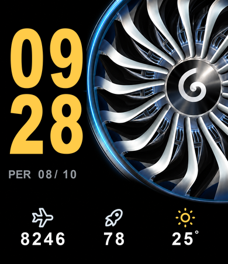
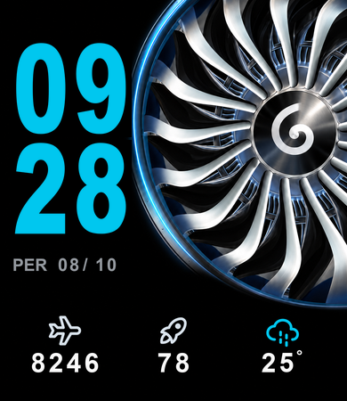
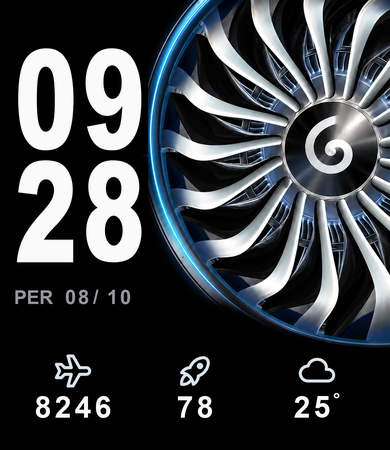

# AeroTurbine Watchface

**Redmi Watch 4 için havacılık temalı dijital kadran.** Parlak motor fanı, büyük saat rakamları ve sade canlı göstergeler.

[English](README.md) · [İndir](https://github.com/KadirYurekturk/aeroturbine-watchface/releases)

  
  
  

## Neler gösteriyor?

- Canlı saat ve dakika, 24 saat biçimi.
- Güneşli havada sarı, yağmur/fırtınada mavi, diğer hava durumlarında beyaz saat.
- Türkçe gün adı ve gün/ay tarihi.
- **Uçak simgesi altında adım sayısı.**
- **Füze simgesi altında pil yüzdesi.** Yüzde işareti gösterilmez; füze simgesi sabittir.
- Hava simgesi ve Celsius sıcaklık; eksi sıcaklıklar desteklenir.

Fan sabittir. Hava bilgisi telefon uygulamasından saate senkronize edilen verilerden alınır. Önizlemelerdeki sayılar örnektir.

## Hangi cihazlara uygun?

Hazır `.bin` dosyası **yalnızca Redmi Watch 4 / 390 × 450 / cihaz tipi 365** için derlenmiştir.

Mi Band 8/9'un 192 × 490, Band 8 Pro/9 Pro'nun 336 × 480 ekranına aynı dosya yüklenmez. Her cihaz için ayrı yerleşim, cihaz ayarı, veri kaynağı kontrolü ve derleme gerekir. [Uyarlama notları](docs/COMPATIBILITY.md).

## Telefona ve saate yükleme

1. [v0.1.0 yayınından](https://github.com/KadirYurekturk/aeroturbine-watchface/releases/tag/v0.1.0) `AeroTurbine-RedmiWatch4-v0.1.0.bin` dosyasını indir.
2. Redmi Watch 4 ile eşleşmiş Android telefonuna kopyala.
3. Uyumlu Notify uygulamasında **Saat yüzünü güncelle** bölümünü açıp yerel `.bin` dosyasını seç.
4. Doğru saatin bağlı olduğunu kontrol edip uygulamanın aktarım adımlarını tamamla.
5. Hava için telefon uygulamasında hava senkronizasyonunun açık olduğundan emin ol.

Bu repo telefon uygulaması dağıtmaz. Menü adları uygulama sürümüne göre değişebilir.

**Saatte çalıştığı doğrulandı:** geliştirici 2026-10-09 tarihinde en son sürümü fiziksel Redmi Watch 4'ünde deneyip çalıştığını bildirdi. Proje ve derleme kontrolleri de geçti; v0.1.0 artık ön sürüm olarak işaretlenmiyor. Bu bildirim, o cihazdaki temel çalışmayı doğrular; tüm hava durumlarının veya firmware sürümlerinin ayrı ayrı test edildiği anlamına gelmez.

## Mi Create ile düzenleme

1. [Mi Create'i](https://github.com/ooflet/Mi-Create/releases) kur.
2. Yayındaki düzenlenebilir proje ZIP'ini indirip çıkar veya repoyu klonla.
3. `watchfaces/redmi-watch-4/AeroTurbine.fprj` dosyasını aç.
4. `images` klasörünü `.fprj` ile aynı klasörde tut.
5. Düzenleyip Redmi Watch 4 için yeniden derle.

`.fprj` düzenleme kaynağı, `.bin` kurulum paketidir. Saat rengini veren hava katmanları rakam maskelerinin altında bulunur; saat bileşenlerini düzenlerken bu sırayı koru.

Varlıkları tekrar üretmek için Windows, Python 3.10+ ve Pillow kullanılır. Komutlar [İngilizce README](README.md#build-and-check) içinde. Derleyici Mi Create kurulumundan alınır; repoya program veya derleyici eklenmedi.

## Lisans ve katkı

Kadir Yürektürk tarafından hazırlanmıştır. Özgün proje düzeni ve betikler [MIT](LICENSE) lisansıyla yayınlanır. Simgeler [Tabler Icons](https://github.com/tabler/tabler-icons), MIT. Fan, GE9X ön fan referansından geliştirilen AI destekli bir görseldir; kaynak fotoğraf paylaşılmamıştır. [Varlık bilgileri](docs/ASSETS.md).

Xiaomi, Redmi, GE Aerospace, TEI veya telefon uygulaması geliştiricileriyle resmî bağlantısı yoktur. Başka cihaz uyarlamalarında ayrı proje klasörü, önizleme ve gerçek cihaz test sonucu eklemen beklenir.
